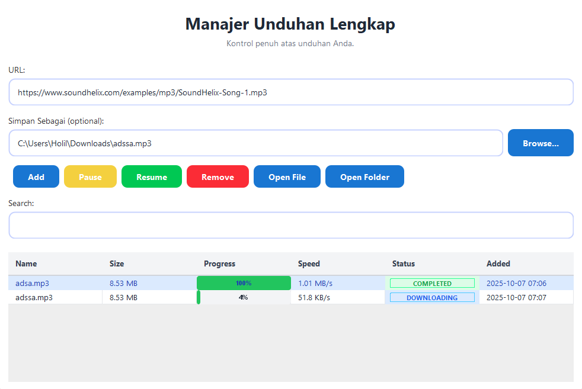

# Simple Downloader GUI

**Manajer Unduhan Lengkap** - Aplikasi GUI Java untuk mengelola dan mengontrol unduhan file dengan antarmuka yang modern dan user-friendly.



## 🚀 Fitur Utama

-   **Multi-threaded Downloads**: Unduhan berjalan di background tanpa memblokir UI
-   **Resume/Pause Downloads**: Kontrol penuh atas proses unduhan
-   **Progress Tracking**: Monitor real-time progress dan kecepatan unduhan
-   **Search & Filter**: Cari unduhan berdasarkan nama atau status
-   **File Management**: Buka file atau folder hasil unduhan langsung dari aplikasi
-   **Modern UI**: Antarmuka yang bersih dengan custom components

## 🔧 Cara Menjalankan

### Prerequisites

-   Java Development Kit (JDK) 8 atau lebih tinggi
-   VS Code dengan Extension Pack for Java (opsional)

### Kompilasi dan Jalankan

1. **Clone repository**:

    ```bash
    git clone https://github.com/Holid-Kurang/SimpleDownloaderGUI.git
    cd SimpleDownloaderGUI
    ```

2. **Kompilasi** (dari terminal/command prompt):

    ```bash
    javac -d bin src/*.java src/component/*.java
    ```

3. **Jalankan aplikasi**:
    ```bash
    java -cp bin App
    ```

### Menggunakan VS Code

1. Buka folder project di VS Code
2. Pastikan Java Extension Pack terinstall
3. Tekan `F5` atau gunakan Run > Start Debugging
4. Atau klik kanan pada `App.java` > Run Java